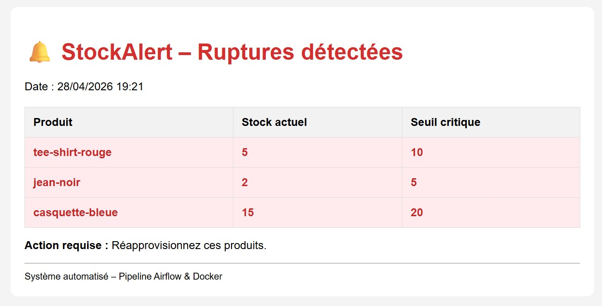

# Portfolio – Joël Gnali LOE  
**Data Analyst | BI Consultant | Analytics Engineer**

---

## 🚀 Projet phare : Ecommerce Factory Pro  
*Détection automatique de ruptures de stock*

Pipeline complet avec **Apache Airflow**, **Docker**, **Python** et **PostgreSQL**.  
- Lit un fichier CSV (produit, quantité, seuil)  
- Détecte les stocks critiques  
- Génère un rapport HTML  

🔗 [Voir le produit en vente](https://payhip.com/b/6Hb1V)

)

---

## 📊 Compétences clés

- **BI & Visualisation** : Power BI (niveau avancé – connexion BigQuery, DAX de base), Tableau, Looker Studio, Excel avancé  
- **Bases de données & Cloud** : SQL (PostgreSQL, SQL Server), **BigQuery** (bonne maîtrise – requêtes, connexion à Looker Studio et Power BI)  
- **Langages & orchestration** : Python (pandas, numpy), Airflow, Docker  
- **Data modeling & ETL** : modélisation, transformation, qualité des données
---

## 💼 Expériences sélectionnées

- **Data Analyst BI Consultant** – Malakoff Humans (2023-2024)  
- **Analyste de données clients** – Orange Côte d’Ivoire (2018-2020)  

## 📊 Mes projets Data Analyst

- [Optimisation des campagnes marketing (Orange)](projet-campagnes-orange) – Python, Power BI
- [Analyse marketing RGPD-compliant (Carrefour)](projet-marketing-rgpd-carrefour) – BigQuery, Looker Studio
- [Analyse géospatiale des transports normands](projet-transports-normandie) – Python, Folium

📄 [Voir mon CV complet sur demande]

---

## 📫 Contact

📧 loegnali@gmail.com  
🔗 [LinkedIn](https://www.linkedin.com/in/joel-gnali-loe)
