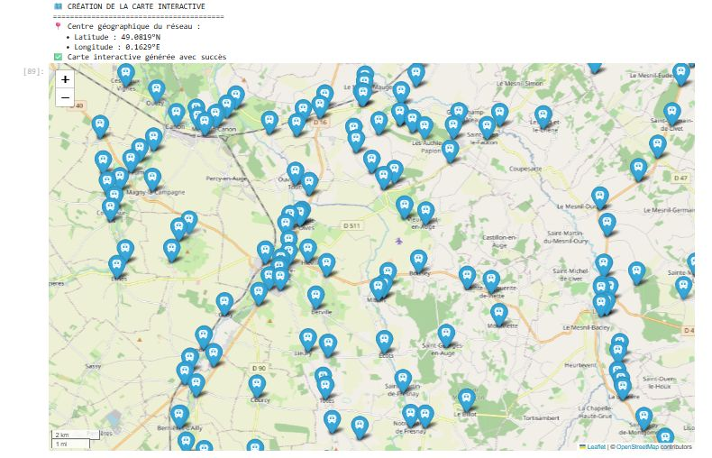
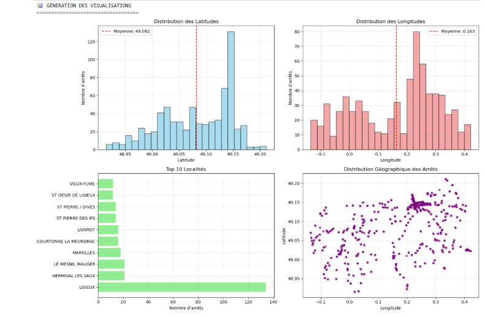

# Projet : Analyse géospatiale des transports normands

## Contexte
Exploration de 707 arrêts de transport public en Normandie (données NeTEx).

## Stack technique
- Python (Pandas, Folium)
- Jupyter Notebook

## Aperçu

## Résultats
- Carte interactive des arrêts
- Distribution des latitudes et longitudes
- Top 10 localités
